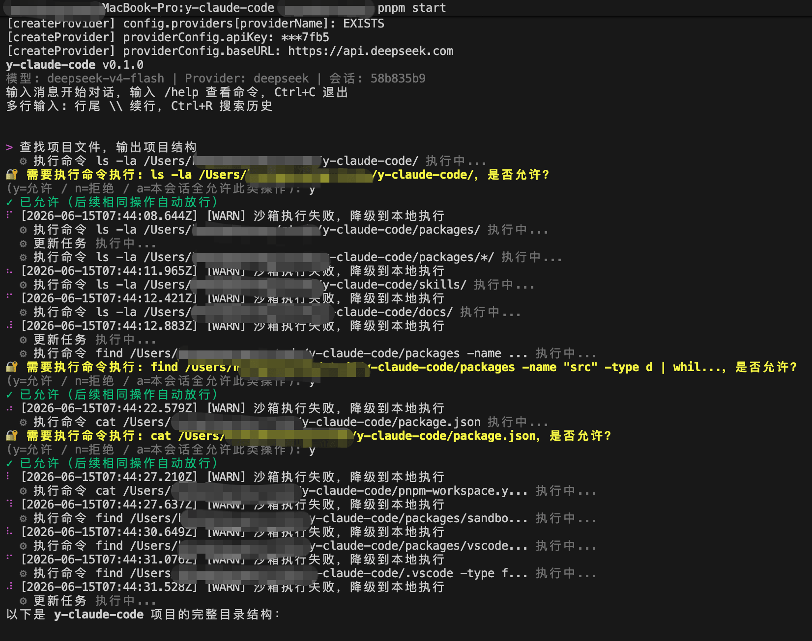
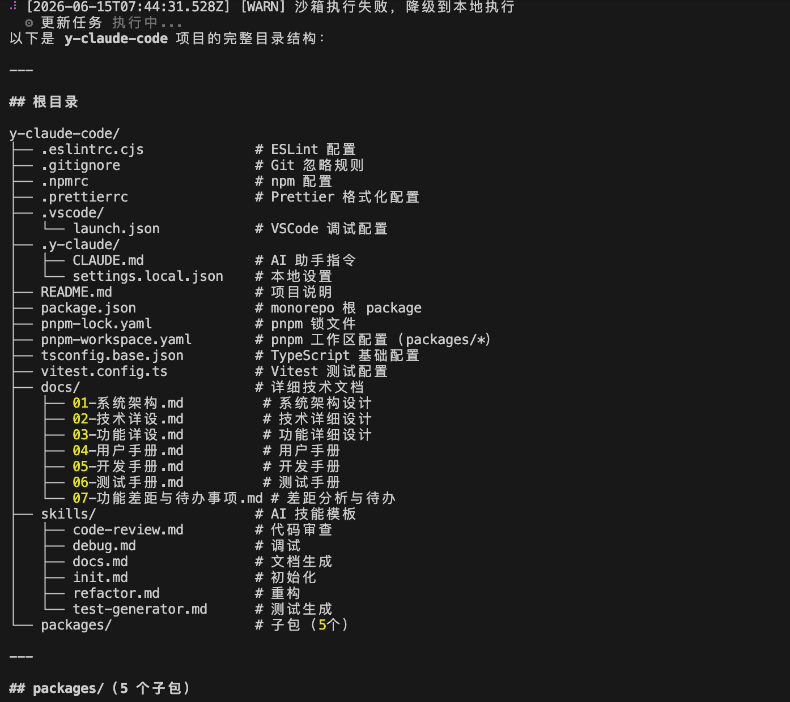
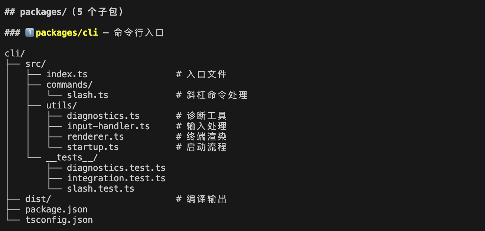
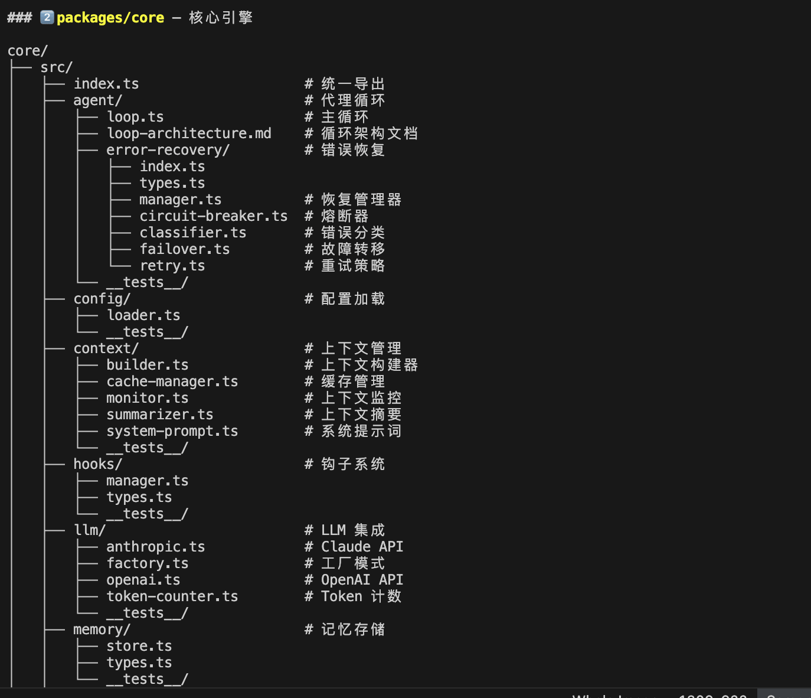
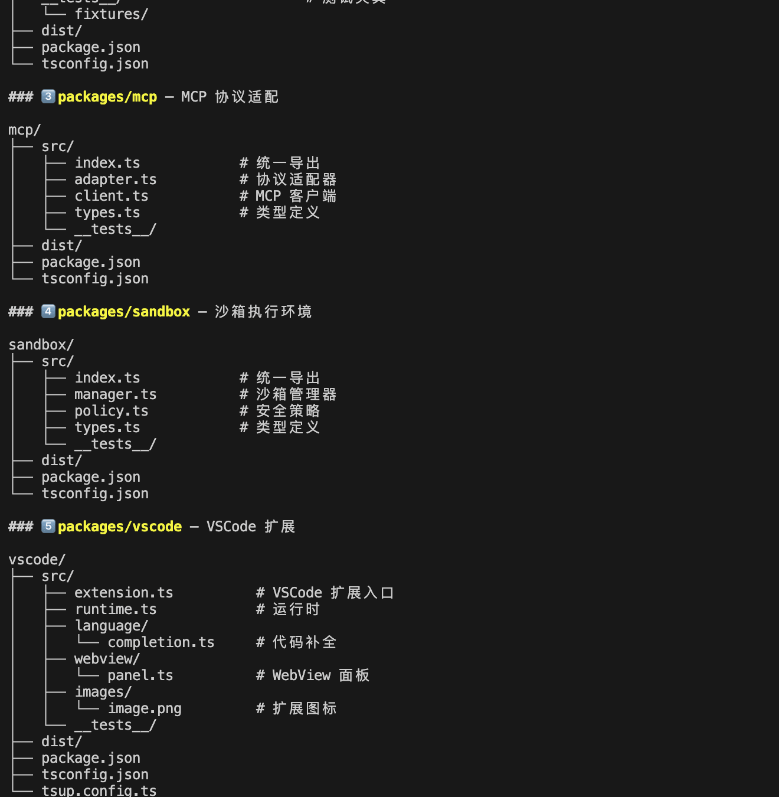
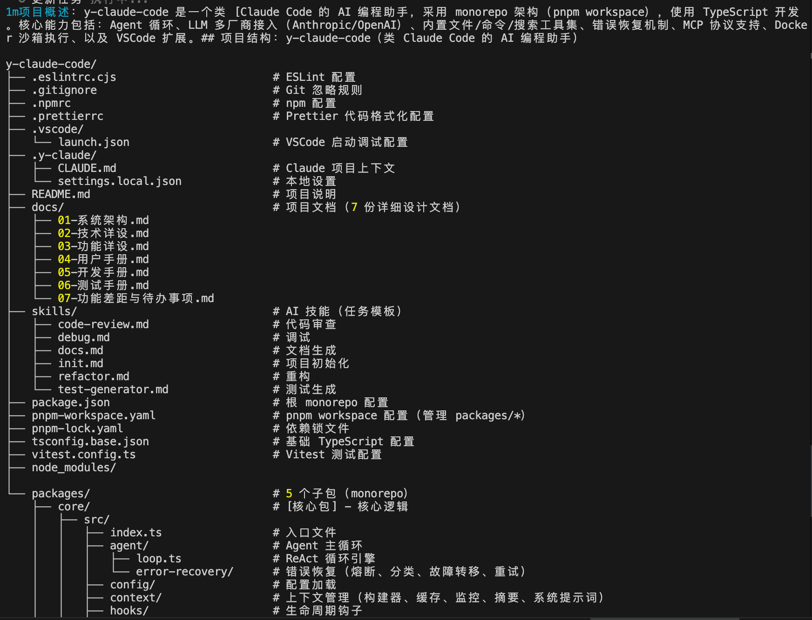
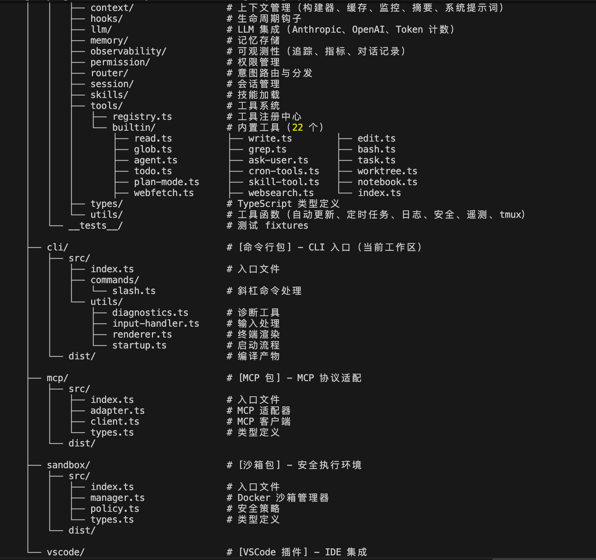
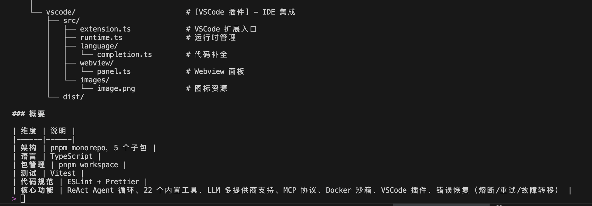

# Y Claude Code

AI 编程助手工具集 — 终端 CLI 与 VS Code IDE 插件双形态，可扩展的 AI Agent 系统

## 架构

```text
用户输入 → IntentRouter(意图路由) → Agent Loop(ReAct) → LLM Provider → 工具执行 → 输出
                │                       │
          内置命令/直接工具    Permission / Hook / Memory / Session
                │                       │
          22 个内置命令          Plan Mode / ErrorRecovery / Summarizer
                                    │
       ┌────────────────────────────┼────────────────────────────┐
       │                            │                            │
  CLI 终端渲染               Observability            VS Code Webview
  (ANSI Markdown,       (Transcript / Metrics      (工具审批 Accept/Reject,
   spinner, writeLine,       / Tracing)              工具调用参数展示)
   空白行压缩)
```

### 模块

| 包 | 说明 |
| ---- | ------ |
| `@y-claude-code/core` | Agent Loop、23 个内置工具、LLM 适配、权限、上下文摘要、可观测性 |
| `@y-claude-code/cli` | readline 交互、ANSI Markdown、权限记忆、22 个命令、环境诊断 |
| `@y-claude-code/sandbox` | Docker 沙箱 — 命令隔离执行、安全策略、降级支持 |
| `@y-claude-code/mcp` | MCP 协议 — JSON-RPC 客户端 + Tool 适配器 |
| `@y-claude-code/vscode` | VS Code 插件 — 内联补全、Webview 面板、流式 Agent Loop |

### 技术栈

TypeScript 5.x strict + Node.js 20+ + pnpm workspace + readline + Anthropic SDK + OpenAI SDK + DeepSeek + Docker (沙箱) + vitest

## 快速开始

### 环境要求

- Node.js >= 20
- pnpm >= 8
- Docker（可选，用于沙箱隔离执行 Bash 命令）

### 安装与运行

```bash
pnpm install
pnpm build
pnpm --filter @y-claude-code/cli dev
```

### 初次配置

首次启动自动进入 LLM 配置向导。配置文件采用多级合并（后者覆盖前者）：

| 优先级 | 路径 | 说明 |
| ------ | ------ | ------ |
| 1（最高） | 命令行参数 | `--model`、`--provider` 等 |
| 2 | 环境变量 | `ANTHROPIC_API_KEY`、`OPENAI_API_KEY` 等 |
| 3 | `.y-claude/settings.local.json` | 项目级本地覆盖，不入版本管理 |
| 4 | `.y-claude/settings.json` | 项目级共享配置，团队共享 |
| 5（最低） | `~/.y-claude-code/config.json` | 用户全局配置 |

**用户全局配置** (`~/.y-claude-code/config.json`)：

```json
{
    "provider": "anthropic",
    "providers": {
        "anthropic": { "apiKey": "sk-ant-xxx" },
        "openai": { "apiKey": "sk-xxx", "baseURL": "https://api.openai.com/v1" }
    },
    "model": "claude-sonnet-4-6"
}
```

**项目级配置** (`.y-claude/settings.json`)，适合提交到仓库供团队共享：

```json
{
    "model": "claude-opus-4-7",
    "permissions": {
        "defaultMode": "ask",
        "rules": [
            { "toolPattern": "Bash(npm test:*)", "action": "allow", "scope": "project" }
        ]
    }
}
```

**本地覆盖** (`.y-claude/settings.local.json`)，适合个人调试，应加入 `.gitignore`：

```json
{
    "provider": "openai",
    "providers": {
        "openai": { "apiKey": "sk-local-xxx", "baseURL": "https://localhost:8080/v1" }
    }
}
```

或仅设置环境变量（适合 CI / 快速体验）：

```bash
export ANTHROPIC_API_KEY="sk-ant-xxx"
```

## 使用

### 工具执行权限

Agent 执行 Bash/Write/Edit 等操作前需要终端确认：

| 按键 | 行为 | 有效期 |
|------|------|--------|
| `y` | 允许本次，记忆此具体操作（同命令基名/同文件路径） | 当前 session |
| `n` | 拒绝 | — |
| `a` | 本会话全允许此类操作（如所有 Bash） | 当前 session |

工具调用展示具体参数，
如 `⚙ 读取文件 src/app.ts 执行中...`、`⚙ 执行命令 npm test 执行中...`。

### 示例对话

```text
> 帮我分析当前项目的代码结构
> 读取 src/app.ts
> 搜索 useState
> 执行 npm test
```

### 命令

**对话与帮助:**

| 命令 | 说明 |
|------|------|
| `/help` 或 `/h` | 显示所有可用命令 |
| `/clear` 或 `/cls` | 清空终端屏幕 |
| `/exit` 或 `/q` | 退出程序 |
| `/fast` | 切换快速模式 |

**模型与配置:**

| 命令 | 说明 |
|------|------|
| `/model <name>` | 切换模型 |
| `/config` | 查看/修改配置 |
| `/thinking` | 切换 Thinking 内容展示 |

**上下文与记忆:**

| 命令 | 说明 |
|------|------|
| `/compact` | 手动触发上下文压缩 |
| `/context` | 查看上下文使用情况 |
| `/memory` | 管理持久记忆 |
| `/remember` | 快速保存记忆 |

**任务与状态:**

| 命令 | 说明 |
|------|------|
| `/tasks` | 查看当前任务列表 |
| `/stats` | 查看会话统计 |
| `/statusline` | 配置状态栏 |

**项目操作:**

| 命令 | 说明 |
|------|------|
| `/init` | 初始化项目 CLAUDE.md |
| `/review` | 代码审查 |
| `/skills` | 列出可用 Skill |
| `/add-dir` | 添加工作目录 |

**诊断与调试:**

| 命令 | 说明 |
|------|------|
| `/doctor` | 环境诊断 |
| `/hooks` | 查看 Hook 配置 |
| `/pr-comments` | 查看 PR 评论 |
| `/tmux` | tmux 会话管理 |

## 项目结构

```text
packages/
├── core/src/
│   ├── types/        # 消息、工具、Agent、配置、会话
│   ├── agent/        # ReAct 主循环 + error-recovery/(重试/熔断/回退)
│   ├── router/       # 意图识别 + 分发
│   ├── llm/          # Anthropic / OpenAI Provider + Token 计数
│   ├── tools/        # 23 个内置工具 + 注册中心
│   ├── context/      # 上下文构建 + 渐进式 LLM 摘要 + 窗口监控
│   ├── permission/   # 权限检查 + 规则持久化
│   ├── session/      # 会话管理 + 文件存储
│   ├── skills/       # Markdown 技能加载(frontmatter + 多级优先级)
│   ├── hooks/        # 生命周期事件钩子
│   ├── memory/       # 用户/项目记忆(user/feedback/project/reference)
│   ├── observability/# JSONL Transcript + Metrics + Span Tracing
│   ├── config/       # cosmiconfig 多级配置加载(4 级合并)
│   └── utils/        # Logger / Cron / Security / AutoUpdate / Telemetry / Tmux
├── cli/src/
│   ├── commands/     # 22 个斜杠命令注册与处理
│   └── utils/        # 输入处理 / 启动器 / 终端渲染(ANSI Markdown) / 环境诊断
├── sandbox/src/      # Docker 容器管理 + 安全策略 + ISandbox 接口
├── mcp/src/          # JSON-RPC 客户端 + Tool 适配器
└── vscode/src/       # Extension + Webview Panel + 内联补全
```

## 测试

| 类别 | 文件数 | 用例数 |
|------|--------|--------|
| core | 31 | 460 |
| cli | 3 | 73 |
| vscode | 3 | 41 |
| sandbox | 1 | 32 |
| mcp | 2 | 25 |
| **合计** | **40** | **631** |

## 设计文档

| 文档 | 说明 |
|------|------|
| [01-系统架构](docs/01-系统架构.md) | 架构分层、数据流、模块依赖、安全模型、错误恢复 |
| [02-技术详设](docs/02-技术详设.md) | 类型体系、Agent Loop、工具系统、LLM 适配、上下文 |
| [03-功能详设](docs/03-功能详设.md) | 23 个工具、22 个命令、Plan Mode、Hook、Memory、Cron |
| [04-用户手册](docs/04-用户手册.md) | 安装、配置、命令参考、权限、Skill、tmux、FAQ |
| [05-开发手册](docs/05-开发手册.md) | 环境搭建、项目结构、添加工具/Provider、调试、发布 |
| [06-测试手册](docs/06-测试手册.md) | 测试策略、覆盖率目标、CI 流水线、检查清单 |
| [07-功能差距](docs/07-功能差距与待办事项.md) | 与 Claude Code 差距对比、已/待实现事项 |

## 与 Claude Code 对比

| 维度 | y-claude-code | Claude Code |
| ---- | :----: | :----: |
| **开源** | 开源 | 闭源（免费使用） |
| **LLM Provider** | Anthropic + OpenAI + DeepSeek 三后端 | 仅 Anthropic |
| **交互形态** | 终端 CLI + VS Code 插件 | 终端 CLI + VS Code / JetBrains 插件 |
| **沙箱执行** | Docker 容器隔离 | 原生系统执行 |
| **工具数量** | 23 个内置工具 | 20+ 内置工具 |
| **权限控制** | 五级权限（default → session → project → user → global） | 四级权限 |
| **配置层级** | 5 级合并（CLI > 环境变量 > local > project > user） | 4 级合并 |
| **Plan Mode** | EnterPlanMode / ExitPlanMode | 原生支持 |
| **子代理** | 4 种类型 + worktree 隔离 | 原生支持 |
| **MCP 协议** | 客户端 + Tool 适配器 | 原生支持 |
| **定时任务** | Cron 调度 + ScheduleWakeup | 原生支持 |
| **可观测性** | JSONL Transcript + Metrics + Tracing | 原生支持 |
| **自动更新** | npm registry 检查 | 原生支持 |
| **安全防护** | Prompt Injection + SSRF + 命令注入 + 输出脱敏 | 原生内置 |

> 详细功能差距见 [07-功能差距与待办事项](docs/07-功能差距与待办事项.md)

## 待优化

| 类别 | 问题 | 影响 |
| ---- | ---- | ---- |
| **IDE 支持** | 仅 VS Code，无 JetBrains / Cursor 插件 | 用户覆盖面受限 |
| **LLM Provider** | Anthropic + OpenAI + DeepSeek，未接入 Ollama / 本地模型等 | 无法使用本地部署或部分国产模型 |
| **沙箱** | 仅 Docker，不支持 Podman / 原生隔离 | 无 Docker 环境时退化为直接执行 |
| **分发方式** | 需 Node.js + pnpm 源码构建，无二进制分发 | 安装门槛较高 |
| **会话管理** | CLI 单会话，不支持多会话并发 | 多任务并行能力弱 |
| **远程能力** | 无 remote agent，不支持 SSH / 远程执行 | 无法管理远程开发环境 |
| **文件系统** | 无数据库 / API 直连，仅文件操作 | 数据处理场景受限 |
| **测试覆盖** | 631 用例，但缺乏大型项目 E2E 验证 | 边缘场景稳定性待观察 |
| **国际化** | 代码注释 / 文档均为中文 | 非中文用户上手困难 |
| **离线模式** | 必须联网调用 LLM API | 无网络时完全不可用 |

## 开发

```bash
pnpm install          # 安装依赖
pnpm typecheck        # 类型检查（全部包）
pnpm test             # 运行单测（40 文件 631 用例）
pnpm build            # 构建全部包
pnpm lint             # 代码检查
pnpm format           # 代码格式化
```

## 效果图

### CLI

| | |
| ---- | ---- |
|  |  |
|  |  |
|  |  |
|  |  |

### VS Code 插件


