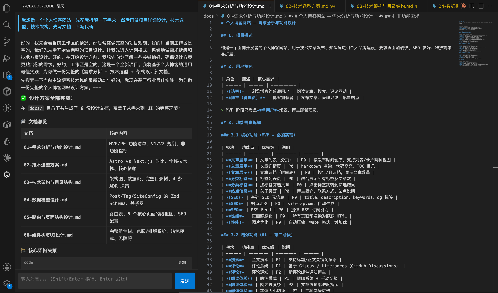

# @y-claude-code/vscode

VS Code 插件 — IDE 内联 AI 编程助手。集成 core 引擎，提供内联补全、Webview 聊天面板、Diff 视图、右键菜单等 IDE 原生体验。

## 文件

| 文件 | 职责 |
|------|------|
| `src/extension.ts` | 插件入口：命令注册（8 个）、Provider 注册、状态栏、激活/停用生命周期 |
| `src/runtime.ts` | 运行时单例：管理 AgentLoop 实例、权限审批回调（postMessage → Webview）、消息流式转发 |
| `src/language/completion.ts` | 内联补全 Provider：语言过滤（17 种）、内容过滤、contextBefore/contextAfter 上下文构建 |
| `src/webview/panel.ts` | Webview 聊天面板：消息管理、流式缓冲、工具调用渲染、审批 Accept/Reject 按钮 |

## Webview 审批流

```
Agent Loop      runtime.ts     Webview Panel
    │                │               │
    ├─ approval ──→  │               │
    │                ├─ postMessage →│  展示审批按钮
    │                │               │
    │                │← postMessage ─┤  用户点 Accept
    │                │               │
    │←─ resolve ──── │               │
```

## 功能

- **内联补全**：编辑器内按需触发，对接 core LLM Provider
- **聊天面板**：Webview 内 Markdown 渲染，工具调用展示关键参数，Accept/Reject 审批按钮
- **Diff 视图**：AI 编辑建议以 `vscode.diff` 原生命令展示
- **Apply 编辑**：一键应用 AI 建议的文件修改
- **右键菜单**：解释选中代码、审查文件
- **设置页面**：图形化配置 provider/model/apiKey/maxToolRounds/showThinking

## 配置

### 配置文件

| 文件 | 作用 | 是否入版本控制 |
|------|------| :---: |
| `.y-claude/settings.json` | 项目共享配置，团队统一的安全策略、权限规则、MCP 服务器等 | ✅ 是 |
| `.y-claude/settings.local.json` | 本地覆盖配置，个人 API Key、模型偏好等敏感或个性化设定 | ❌ 否 (在 .gitignore) |
| `~/.y-claude-code/config.json` | 用户全局配置，跨项目生效的个人默认偏好 | — |

### 优先级链

配置按以下顺序合并，**后者覆盖前者**：

```
默认值  <  用户全局配置  <  settings.json  <  settings.local.json  <  环境变量  <  命令行参数
(最低)                                                                                    (最高)
```

- **环境变量**优先级高于文件：`ANTHROPIC_API_KEY`、`OPENAI_API_KEY`、`Y_CLAUDE_CODE_MODEL`、`Y_CLAUDE_CODE_PROVIDER` 等
- **settings.local.json** 覆盖 **settings.json**：允许开发者本地调整权限、MCP 等而不污染团队配置
- 合并策略：嵌套对象（如 `providers`）深度递归合并，基础类型和数组直接覆盖

### 配置项

```json
{
    "provider": "anthropic",
    "model": "claude-sonnet-4-6",
    "providers": {
        "anthropic": { "apiKey": "sk-ant-...", "baseURL": "https://api.anthropic.com", "defaultModel": "claude-sonnet-4-6" },
        "openai": { "apiKey": "sk-...", "defaultModel": "gpt-5" }
    },
    "maxToolRounds": 50,
    "maxTokensPerTurn": 16000,
    "thinkingEnabled": false,
    "thinkingTokens": 4000,
    "showThinking": false,
    "permissions": {
        "defaultMode": "ask",
        "rules": [
            { "toolPattern": "Bash", "action": "ask", "scope": "project" },
            { "toolPattern": "Read", "action": "allow", "scope": "global" }
        ]
    },
    "theme": "dark",
    "mcpServers": {
        "filesystem": { "command": "npx", "args": ["-y", "@anthropic-ai/mcp-server-filesystem", "/path"] }
    },
    "env": { "NODE_ENV": "development" },
    "autoUpdateCheck": true,
    "telemetryEnabled": true
}
```

### 典型工作流

```text
团队 settings.json (共享安全策略)
    └─ 不允许 Bash 但未提供 API Key
        └─ 个人 settings.local.json (本地覆盖)
            └─ 添加自己的 API Key，开启 thinking
                └─ 环境变量 ANTHROPIC_API_KEY (CI/CD 注入)
                    └─ 最终生效配置
```

## 调试

```bash
# 在 VS Code 中按 F5 启动 Extension Development Host
# 或
code --extensionDevelopmentPath=packages/vscode
```

## 交互示例

```text
1. 内联补全 — 编辑器中写代码，AI 自动建议补全
   ┌──────────────────────────────────────────────┐
   │  function fibonacci(n: number): number {      │
   │      // AI 内联提示: if (n <= 1) return n    │  ← 按 Tab 接受
   │  }                                            │
   └──────────────────────────────────────────────┘

2. 聊天面板 — Cmd+Shift+P → "Claude Code: Chat"
   ┌──────────────────────────────────────────────┐
   │  > 帮我给这个函数写单元测试                     │
   │  ─────────────────────────────────────────── │
   │  ⚙ 读取文件 src/utils.ts            执行中...  │
   │  ⚙ 编辑文件 src/__tests__/utils.test.ts       │
   │     🔐 需要确认: 编辑文件 utils.test.ts       │
   │        [ Accept ]  [ Reject ]                  │
   │  ─────────────────────────────────────────── │
   │  ✓ 已创建 3 个测试用例，覆盖边界情况             │
   └──────────────────────────────────────────────┘

3. Diff 视图 — AI 建议的代码变更以原生 diff 展示
   ┌──────────────────────────────────────────────┐
   │  src/utils.ts [AI Suggested Edit]             │
   │  ─────────────────────────────────────────── │
   │  - function add(a, b) { return a + b; }       │
   │  + function add(a: number, b: number): number  │
   │  +     { return a + b; }                      │
   │  ─────────────────────────────────────────── │
   │  [ Apply Edit ]  [ Discard ]                   │
   └──────────────────────────────────────────────┘
```


